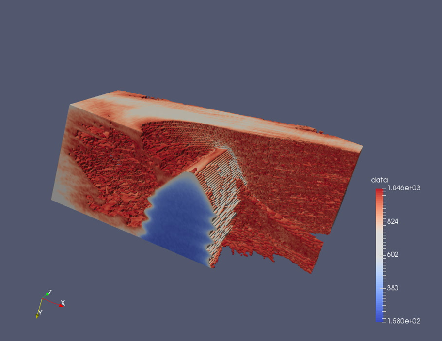

Feature A
=========

Subsection
----------

Exciting documentation in here.
Let's make a list (empty surrounding lines required):

- item 1

  - nested item 1
  - nested item 2

- item 2
- item 3

Subsection 2
------------

More documentation

- item A
- item B

Level 3
^^^^^^^

Level 4
"""""""

`A link <http://www.google.com>`_

1. item 1
2. item 2
#. item 3
#. item 4

====== ======
No.    Prime
====== ======
1      No
2      Yes
3      Yes
4      No
====== ======

The following is a code block::

  def hello():
      print("Hello world")
      
.. code-block:: c

   #include <stdio.h>
   int main()
   {
      printf("Hello, World!");
      return 0;
    }
